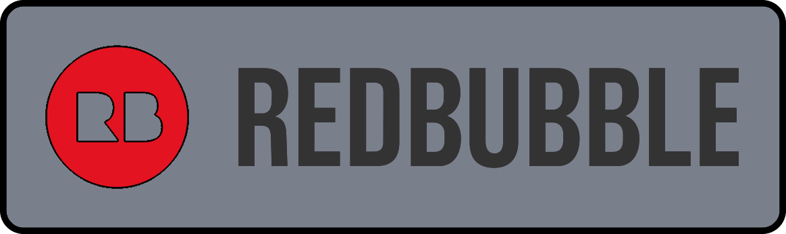

# PBR-Bow
A very simple faux bow, the PBR (Pull Back and Release) Bow.

## Description

The PBR Bow (Pull Back and Release) is a very simple faux bow blaster with a modular front end for many different loading methods and ammo types. 

## Modular Front Ends

There are many different front end modules for the PBR bow:
- 
- 

## Sellers
Hardware is available from these sellers:
- WIP

Fully printed/assembled blasters are available from these sellers:
- WIP

## Print Info

Infills:
- Black: 
- - Print 2x GripBody.
- - PlungerRod, BackBracket, BackBlock, 100% Gyroid, 5+ walls.
- - Everything else, 20% Gyroid, 5 walls. 

- Orange: 
- - PrimingHandleBracket, 100% infill, 5 walls.
- - Print 2x PrimingHandleBracket.
- - Everything else, 20% Gyroid, 5 walls. 

- Green: 
- - Print 2x of each green part.
- - Everything, 20% Gyroid, 5 walls. 
- - Go 100% infill 5 walls for extra strength (recommended).

- All Attachments:
- - Everything, 20% Gyroid, 5 walls. 

## Hardware

Full hardware list: https://docs.google.com/spreadsheets/d/1sMbMzZiYjJnqrFWFHJ_mY_JVUDBdcfN-nKqcblzo42Q/edit?usp=sharing

## Assembly

Video: WIP

## Misc.

**If you build any of my designs, I'd love to see yours! Feel free to message me on Discord (Sillybutts#5905) or tag me on a post on Reddit (u/SillyTheGamer).**

**If you are having issues with any of my designs, let me know on Discord (Sillybutts#5905) or Reddit (u/SillyTheGamer).**

**If you wish to print and sell this item, please contact me for licensing. I can be reached on Discord (Sillybutts#5905) or Reddit (u/SillyTheGamer). iamsillybutts@gmail.com email too.**
**你好！ 我擁有這個設計。 想生產請聯繫我. 你好！ 我拥有这个设计。 如果你想生产，请联系我.**

 This work is licensed under a <a rel="license" href="http://creativecommons.org/licenses/by-nc-sa/4.0/">Creative Commons Attribution-NonCommercial-ShareAlike 4.0 International License</a>.

**Disclaimer: This is not a toy. This blaster is meant for hobbyists, not children. Blaster must be operated correctly to avoid injury. I am not responsible for any injuries from this blaster. Please use a bright/blaze orange muzzle and barrel cap on this blaster. Consult local laws before building this high powered blaster.**

## If you like what I do, please consider supporting me!

**I don't charge for my files, so any donations or merch purchases would be greatly appreciated!**

 https://www.redbubble.com/people/Sillybutts/shop RedBubble full of fun Nerf-y sticker and merch designs!  

 https://www.patreon.com/sillybutts Monthly donations

 https://www.buymeacoffee.com/sillybutts One-time donations

And here's my Etsy: https://www.etsy.com/shop/sillybuttsshop

## Images

